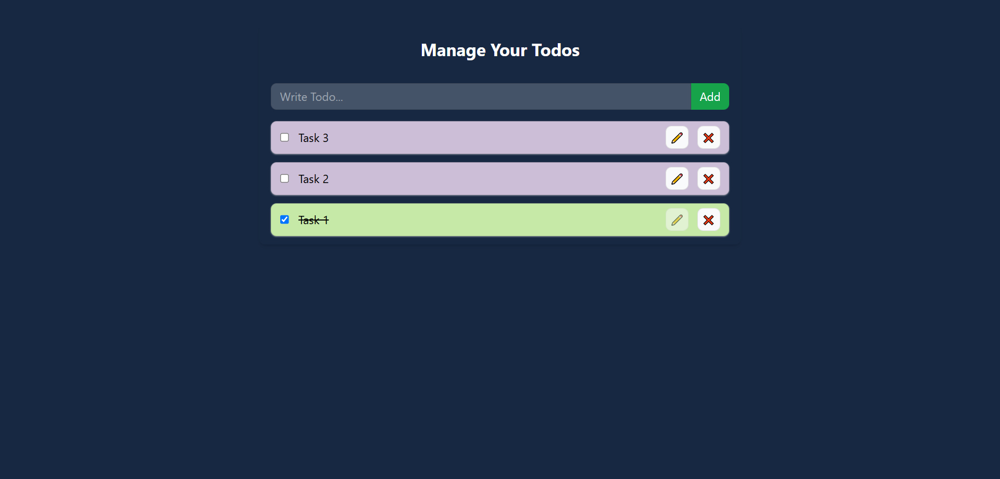

# To-Do List App - useContext API
Hi, this repository contains a Todo List app built with ReactJS. The app enables users to add, update, and delete tasks, offering a simple and effective way to manage daily activities. It utilizes React's useContext API for state management, with useState and useEffect hooks for managing component states and effects.

Built with:

  

## Output:

